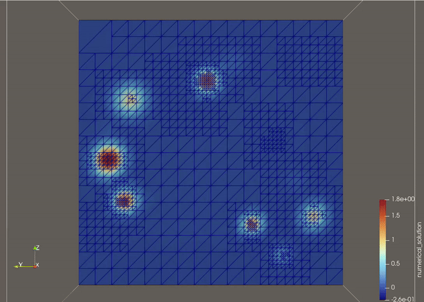

# Space and Time adaptivity

#### Numerical Methods for Partial Differential Equations – Project 2024/25 - Politecnico di Milano

This project explores **adaptive methods** in both **space and time** for solving partial differential equations. We focus on the heat equation with a localized, time-dependent forcing term characterized by sharp, frequent impulses. The goal is to capture steep solution features accurately while minimizing computational cost through dynamic mesh and time step refinement based on error estimates. We implemented an adaptive solver using the `deal.II` library and evaluated its effectiveness in terms of accuracy and efficiency.

# TODO add final results.csv file inside results folder

**Students**

- [Leonardo Arnaboldi](https://github.com/leo-arnaboldi)
- [Luca Donato](https://github.com/lucacris72)
- [Tommaso Crippa](https://github.com/crippius)
- [Felipe Epia](https://github.com/fffeelipe)

**Professor**: _Alfio Maria Quarteroni_

**Assistant Professor**: _Michele Bucelli_

## Strong formulation

$$
\begin{cases}
\begin{aligned}
\frac{\partial u}{\partial t} - \nabla \cdot (\mu \nabla u) &= f && \text{in } \Omega \times (0,T), \\
\mu \nabla u \cdot \mathbf{n} &= 0 && \text{on } \partial \Omega \times (0,T), \\
u &= 0 && \text{in } \Omega \times \{0\},
\end{aligned}
\end{cases}
$$

$$
f(\mathbf{x},t) = g(t)h(\mathbf{x}), \quad
g(t) = \frac{\exp(-a \cos(2N \pi t))}{\exp(a)}, \quad
h(\mathbf{x}) = \exp\left(-\left(\frac{|\mathbf{x} - \mathbf{x}_0|}{\sigma}\right)^2\right),
$$

$$
\text{where } a > 0,\; N \in \mathbb{N},\; x_0 \in \Omega,\; \text{and } \sigma > 0.
$$

## Prerequisites

- **deal.II** ≥ 9.0.
- **C++** compiler (C++11 or later).
- **CMake** ≥ 3.12.

To utilize the python scripts inside the `scripts` directory, you can set up the conda environment named `pdeEnv` to properly run the python scripts in two simple steps:

---

1. **Create the environment:**

```bash
conda env create -f pdeEnv.yml
```

2. **Activate the environment:**

```bash
conda activate pdeEnv
```

## Compiling

To build the executable, make sure you have loaded the needed modules with

```bash
module load gcc-glibc dealii
```

Then run the following commands:

```bash
cd cpp_program
mkdir build
cd build
cmake ..
make
```

## Execution

The program can be executed from the `build` folder through

```bash
$ ./main path/to/parameter_file.prm
```

where `parameter_file.prm` is a file that contains all of the hyperparameters utilized by the solver like:

- Space/Time Adaptivity flags
- Discretization Details
- More advanced parameters for space and time adaptivity

There is a template parameter file `parameters_base.prm` that can be used for the execution by writing:

```bash
./main ../parameters_base.prm
```

## Results

<p align="center">
  
</p>

## Testing

### Accuracy Benchmark

To run the automatic tester that executes different configurations of the solver type:

```bash
python scripts/accuracy_benchmark.py
```

The program will save each simulation `.vtu` files inside a dedicated folder in the `test_runs` directory, together with the output log and their own parameter file. The summary of all the runs will be found inside `results.csv`.

### Scalability Testing

In order to run our solver on the **MareNostrum HPC cluster** of the Barcelona Supercomputing Center, we adopted a container-based approach using **Singularity**.

The scalability tests are managed via Slurm scripts. To execute the benchmark on the General Purpose (GP) partition, submit the following job:

```bash
cd scripts
sbatch scalability_MN.slurm

The results from the scalability benchmarks are available in the `results/` directory.


## Project Structure

```text
root/
├── cpp_program/                     # Main C++ solver implementation
│   ├── src/
│   │   ├── Heat.hpp                # Heat equation solver class header
│   │   ├── Heat.cpp                # Heat equation solver implementation
│   │   └── main.cpp                # Entry point, parameter parsing
│   ├── build/                      # Compiled binaries
│   ├── tests/                      # Test utilities and scripts
│   ├── CMakeLists.txt              # Build configuration
│   ├── CMakeLists_singularity.txt  # Build config for Singularity containers
│   ├── parameters_base.prm         # Template parameter file for solver
│   └── singularity.def             # Container definition file
├── scripts/                        # Python benchmarking and analysis tools
│   ├── accuracy_benchmark.py       # Runs multiple configurations, computes errors
│   ├── analyze_scalability.py      # Analyzes scalability benchmark results
│   ├── scalability_benchmark.sh    # Strong scaling test runner
│   └── scalability_results/        # Scalability benchmark output files
├── pdeEnv.yml                      # Conda environment specification
└── README.md                       # This file
```
